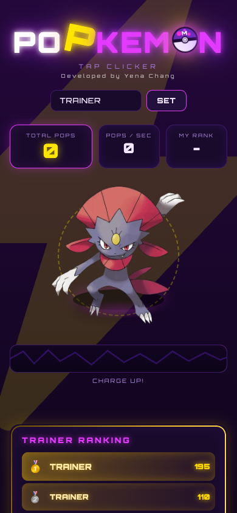
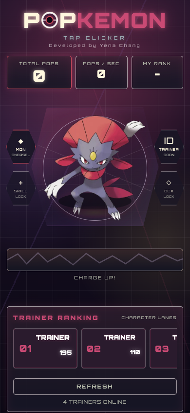
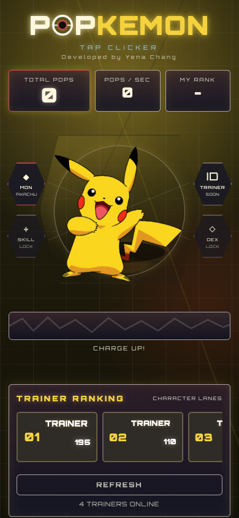
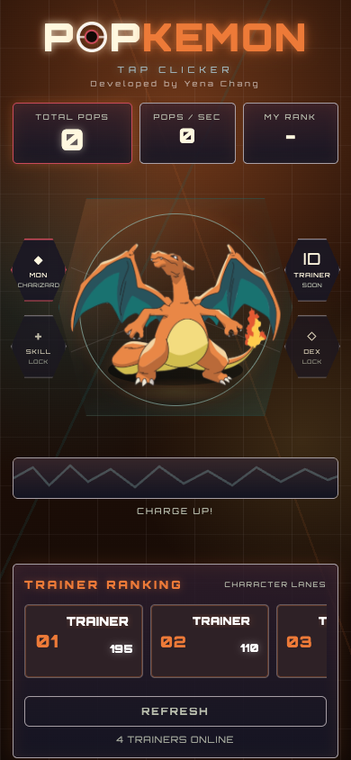

# POPKEMON UX/UI Design Story

## One-Line Summary

POPKEMON은 단순 클릭 게임을 캐릭터 기반 모바일 웹앱으로 확장하기 위해, 첫 행동의 마찰을 줄이고 선택한 포켓몬의 정체성이 화면 전체에 반영되는 테마 시스템으로 재설계했다.

## Before / After

### Before: 단일 네온 클릭커 화면

기존 화면은 강한 네온, 큰 번개 장식, 상단 이름 입력, 포켓몬 이미지, 랭킹 영역이 각각 따로 존재했다. 첫 방문자는 게임의 핵심 행동인 탭보다 이름 입력을 먼저 마주했고, 포켓몬 이미지는 인터페이스 시스템의 일부라기보다 중앙에 배치된 독립 이미지처럼 보였다.

### After: 캐릭터별 소유 영역을 가진 모바일 웹앱

개선 후 화면은 포켓몬별 대표 색이 배경, 로고, 스탯, 중앙 아레나, 게이지, 리더보드까지 확장된다. 사용자는 글을 읽기 전에 현재 어떤 캐릭터 영역에 들어왔는지 인지할 수 있고, 앞으로 포켓몬 선택/아이덴티티/캐릭터별 랭킹으로 확장해도 같은 구조를 유지할 수 있다.

## Design Problem

초기 POPKEMON은 클릭 카운터와 글로벌 리더보드라는 핵심 기능은 명확했지만, 서비스 확장 관점에서는 세 가지 문제가 있었다.

1. 첫 행동 이전에 이름 입력이 노출되어 가치 경험보다 설정 행동이 앞섰다.
2. 포켓몬 이미지와 UI 프레임이 분리되어 보여 캐릭터 기반 서비스라는 방향성이 약했다.
3. 리더보드가 단일 리스트로만 보였기 때문에 향후 포켓몬별 랭킹, 트레이너 아이덴티티, 캐릭터 선택 기능을 수용하기 어려웠다.

## Product Hypothesis

선택한 포켓몬의 색과 분위기가 화면 전체에 반영되면 사용자는 현재 상태를 더 빠르게 인지하고, 자신의 캐릭터 영역에 들어왔다는 소유감을 느낄 것이다. 이 소유감은 재방문, 랭킹 확인, 이름 설정 전환에 긍정적으로 작용할 수 있다.

측정 관점에서는 다음 지표로 검증한다.

- `first_pop`: 방문 후 첫 탭까지 걸린 시간 감소
- `pop_10`: 재미 확인 지점 도달률
- `name_set`: 10팝 이후 이름 설정 전환율
- `ranking_view`: 랭킹 확인율
- `return_visit`: 재방문율

## Design Decisions

### 1. 이름 입력을 첫 탭 이후로 미뤘다

이전 화면은 상단에서 이름 입력을 먼저 요구했다. 하지만 첫 방문자에게 중요한 것은 “내가 무엇을 하면 재미가 생기는가”를 즉시 이해하는 것이다. 그래서 이름 입력은 10팝 이후 랭킹 진입 시점에 노출되도록 바꿨다.

UX 근거:

- 사용자가 가치를 경험하기 전에는 입력 비용을 낮춰야 한다.
- 클릭 게임의 핵심 가치는 첫 탭의 즉각적 피드백이다.
- 이름 설정은 랭킹에 오르고 싶다는 동기가 생긴 뒤에 더 자연스럽다.

포트폴리오 문장:

> 첫 방문자의 행동 순서를 재정렬했다. 이름 입력을 제거한 것이 아니라, 랭킹에 참여할 이유가 생기는 10팝 이후로 미뤄 설정 비용을 가치 경험 뒤에 배치했다.

### 2. 캐릭터 색을 포인트가 아니라 공간 시스템으로 확장했다

처음에는 포켓몬 이미지가 중앙에 있고 주변 UI는 별도의 네온 장식처럼 보였다. 이후에는 `body[data-mon]` 기반 CSS 토큰을 만들어 포켓몬별 색이 화면 전체에 전파되도록 했다.

적용 범위:

- 배경 광원
- POPKEMON 로고의 O와 타이틀 액센트
- 스탯 칩
- 중앙 geometric cockpit frame
- 터치 링과 플랫폼
- 차지 게이지
- 랭킹 카드와 순위 숫자
- 팝 피드백 글로우

UX 근거:

- 사용자는 텍스트보다 색과 공간 분위기로 상태를 빠르게 인지한다.
- 캐릭터 선택 경험에서는 “내가 선택한 캐릭터의 화면”이라는 소유감이 중요하다.
- 포인트 컬러만 바꾸면 이미지가 교체된 느낌에 머물지만, 배경과 시스템 UI까지 바뀌면 모드 전환이 명확해진다.

포트폴리오 문장:

> 캐릭터 이미지만 교체하는 방식은 확장성이 낮다고 판단했다. 포켓몬의 대표 색을 화면 전체 토큰으로 연결해, 선택한 캐릭터가 단순 이미지가 아니라 사용자가 진입한 플레이 영역처럼 느껴지도록 설계했다.

### 3. 중앙 이미지를 geometric cockpit 안에 넣었다

캐릭터가 UI와 따로 노는 느낌을 줄이기 위해, 중앙에 관제탑/계기판 느낌의 geometric frame을 만들었다. 포켓몬은 이 프레임 안에서 주 터치 대상이 되고, 좌우에는 향후 기능 슬롯인 MON, SKILL, TRAINER, DEX를 배치했다.

UX 근거:

- 모바일 클릭 게임에서는 터치 타깃이 화면의 시각적 중심이어야 한다.
- 좌우 기능 슬롯은 지금은 잠금 상태지만, 서비스 확장 방향을 미리 암시한다.
- 프레임은 장식이 아니라 “여기가 조작 영역”이라는 affordance 역할을 한다.

포트폴리오 문장:

> 포켓몬을 단순히 크게 배치하지 않고, 조작 가능한 cockpit 안에 넣어 시각적 중심과 인터랙션 중심을 일치시켰다.

### 4. 리더보드를 horizontal character lane으로 바꿨다

기존 세로 리스트는 일반 랭킹처럼 보였지만, 향후 포켓몬별 랭킹으로 확장하기에는 구조적 힌트가 약했다. 그래서 모바일에서 좌우 스크롤 가능한 ranking lane 형태로 전환했다.

UX 근거:

- 모바일 화면은 세로 공간이 좁기 때문에 랭킹을 카드형 horizontal lane으로 분산하는 것이 확장에 유리하다.
- 캐릭터별 랭킹이 추가되면 같은 패턴을 유지한 채 lane을 늘릴 수 있다.
- 사용자는 현재 순위 카드와 주변 순위를 좌우로 탐색할 수 있어 리더보드가 더 인터랙티브하게 느껴진다.

포트폴리오 문장:

> 리더보드를 단순 결과 리스트가 아니라 향후 캐릭터별 경쟁을 담을 수 있는 horizontal lane으로 재구성했다.

### 5. 시각적 노이즈를 줄이고 캐릭터별 3색 체계로 제한했다

초기 화면은 보라, 노랑, 마젠타, 금색, 번개 장식이 동시에 강하게 보여 AI 생성형 디자인처럼 의도를 읽기 어려웠다. 개선 후에는 캐릭터별로 primary, secondary, signal 세 계열만 남겼다.

팔레트 구조:

- Sneasel: 보라/자주 기반의 날카롭고 야간적인 분위기
- Pikachu: 노랑을 중심으로 검정 구조와 빨강 신호를 보조
- Charizard: 주황 열감, 날개색 teal, 크림색 signal

UX 근거:

- 색이 너무 많으면 사용자는 정보 위계보다 장식을 먼저 보게 된다.
- 대표색, 구조색, 신호색을 분리하면 캐릭터성은 유지하면서 버튼/랭킹/게이지의 의미를 잃지 않는다.
- 캐릭터 variation이 있어도 레이아웃과 정보 위계가 유지되어 사용자는 재학습 없이 플레이할 수 있다.

## Portfolio Case Study Structure

### 1. Project Context

POPKEMON은 모바일 웹에서 작동하는 클릭 카운터 게임이다. 사용자는 포켓몬을 탭해 점수를 올리고 글로벌 리더보드에서 순위를 확인한다. 이후 포켓몬 선택, 트레이너 아이덴티티, 캐릭터별 랭킹으로 확장될 예정이었다.

### 2. Problem

초기 UI는 강한 네온 비주얼을 가지고 있었지만, 포켓몬 이미지와 인터페이스가 분리되어 보였고 첫 행동보다 이름 입력이 먼저 노출되었다. 또한 단일 리더보드 구조는 앞으로의 캐릭터별 경쟁 경험을 설명하기 어려웠다.

### 3. Hypothesis

첫 행동의 마찰을 줄이고, 선택한 포켓몬의 색이 화면 전체에 반영되면 사용자는 더 빠르게 탭을 시작하고 자신의 캐릭터 영역에 들어왔다는 감각을 얻을 것이다.

### 4. Solution

- 이름 입력을 10팝 이후 랭킹 진입 시점으로 이동
- 캐릭터별 CSS theme token 시스템 도입
- 중앙 포켓몬을 geometric cockpit frame 안에 배치
- 리더보드를 horizontal character lane으로 전환
- 캐릭터별 대표색을 전체 화면의 분위기로 확장

### 5. Measurement Plan

| Metric | Why It Matters | Expected Direction |
| --- | --- | --- |
| `first_pop` elapsed ms | 첫 행동까지의 마찰 | 감소 |
| `pop_10` conversion | 재미 확인 지점 도달 | 증가 |
| `name_set` conversion | 랭킹 참여 의사 | 증가 |
| `ranking_view` | 경쟁 맥락 확인 | 증가 |
| `return_visit` | 소유감/재방문 동기 | 증가 |

### 6. Result Framing

표본이 충분히 쌓이면 개선/중립/악화를 구분한다. 표본이 부족한 경우에는 결론을 단정하지 않고 “판정 보류”로 기록한다. 이 프로젝트의 핵심은 예쁜 화면 제작이 아니라, 디자인 선택을 가설과 지표에 연결하는 것이다.

## Resume / Application Notes

### Short Bullet

- 클릭 카운터 게임 POPKEMON의 UX/UI를 개선하며 첫 행동 마찰을 줄이고, 캐릭터별 테마 시스템과 모바일 리더보드 구조를 설계해 향후 포켓몬 선택/아이덴티티 확장 기반을 마련했습니다.

### Metrics-Oriented Bullet

- `first_pop`, `pop_10`, `name_set`, `ranking_view`, `return_visit` 퍼널을 정의하고, 이름 입력 지연과 캐릭터별 화면 테마화를 가설 단위로 분리해 측정 가능한 UX 개선 프로세스를 구축했습니다.

### Product Design Bullet

- 포켓몬별 대표 색을 단순 포인트 컬러가 아닌 배경, 로고, 스탯, 아레나, 게이지, 리더보드 전반에 적용되는 design token으로 구조화해 캐릭터 소유감과 서비스 확장성을 강화했습니다.

### Frontend Implementation Bullet

- 빌드 도구 없이 단일 `index.html` 구조를 유지하면서 CSS variable 기반 theme system, 모바일 터치 최적화, horizontal ranking lane, delayed name prompt를 구현했습니다.

## Interview Talking Points

- “왜 이름 입력을 뒤로 미뤘나요?”
  - 사용자가 게임의 가치를 경험하기 전에는 입력이 마찰이 되기 때문입니다. 10팝 이후에는 랭킹 참여 동기가 생기므로 같은 입력도 더 자연스럽게 받아들여집니다.

- “왜 화면 전체 색이 바뀌어야 했나요?”
  - 앞으로 포켓몬 선택이 들어오면 사용자는 현재 어떤 캐릭터로 플레이 중인지 즉시 알아야 합니다. 라벨보다 색과 공간 분위기가 빠르기 때문에 전체 화면을 캐릭터 영역으로 설계했습니다.

- “왜 horizontal leaderboard인가요?”
  - 모바일에서 세로 공간을 덜 차지하면서도 향후 캐릭터별 랭킹 lane을 확장하기 쉽기 때문입니다. 현재 구조를 바꾸지 않고 포켓몬별 경쟁 맥락을 추가할 수 있습니다.

- “이 디자인이 단순 미감 개선이 아니라는 근거는 무엇인가요?”
  - 각 변경은 퍼널 지표와 연결되어 있습니다. 이름 입력 지연은 `first_pop`과 `name_set`, 캐릭터 테마는 `return_visit`과 `ranking_view`, 리더보드 구조는 랭킹 탐색 행동과 연결됩니다.

## Final Portfolio Copy

POPKEMON의 UX/UI 개선은 단순한 리디자인이 아니라, 캐릭터 기반 서비스로 확장하기 위한 경험 구조 재설계였다. 첫 방문자가 이름 입력보다 탭의 재미를 먼저 경험하도록 플로우를 바꾸고, 포켓몬별 대표 색이 화면 전체에 반영되는 테마 시스템을 만들었다. 이를 통해 사용자는 선택한 캐릭터의 영역에 들어왔다는 감각을 얻고, 향후 포켓몬 선택·트레이너 아이덴티티·캐릭터별 리더보드로 확장 가능한 기반을 갖게 된다. 모든 변경은 `first_pop`, `pop_10`, `name_set`, `ranking_view`, `return_visit` 같은 퍼널 지표와 연결해 측정 가능한 UX 개선으로 설계했다.
